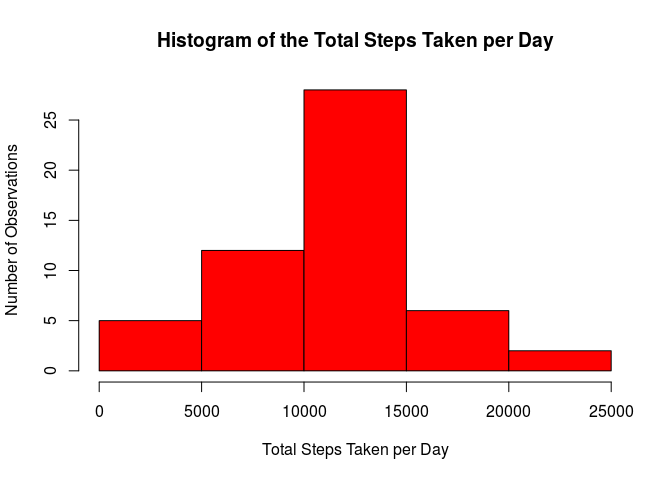
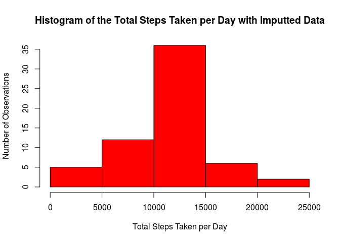

# Reproducible Research: Peer Assessment 1

## Loading required libraries

First, we have to load required libraries. I find the *dplyr* library handy and use it on this project. To do the panels in the last plot, I will use the *lattice* library.


```r
library(dplyr)
```

```
## 
## Attaching package: 'dplyr'
```

```
## The following objects are masked from 'package:stats':
## 
##     filter, lag
```

```
## The following objects are masked from 'package:base':
## 
##     intersect, setdiff, setequal, union
```

```r
library(lattice)
```

## Loading and preprocessing the data

Next, we have to load and pre-process the data. Assuming the zip file is unpacked and we have the *activity.csv* file in the current workng directory, we can read it and convert the date column to POSIX format. I keep the dataset as is in the *original_dataset* because we will need it later for imputing data.


```r
original_dataset <- read.csv(file = "activity.csv", sep = ",")
original_dataset$date <- as.Date(x = original_dataset$date, format = "%Y-%m-%d")
head(original_dataset)
```

```
##   steps       date interval
## 1    NA 2012-10-01        0
## 2    NA 2012-10-01        5
## 3    NA 2012-10-01       10
## 4    NA 2012-10-01       15
## 5    NA 2012-10-01       20
## 6    NA 2012-10-01       25
```

## What is mean total number of steps taken per day?

In order to do this, using dplyr functions we have to first filter the NA's (and the zeroes, although this one is not necessary, I did it only to reduce the number of records).
With a filtered dataset, we can use the aggregate function on the steps by date. 


```r
dataset <- original_dataset %>% filter(!is.na(steps), steps > 0)
total_steps_by_day  <- aggregate(steps ~ date, data = dataset, FUN=sum)
head(total_steps_by_day)
```

```
##         date steps
## 1 2012-10-02   126
## 2 2012-10-03 11352
## 3 2012-10-04 12116
## 4 2012-10-05 13294
## 5 2012-10-06 15420
## 6 2012-10-07 11015
```

This gives us the total steps by day. We can plot it to better understand the data.


```r
with(total_steps_by_day, hist(steps,
                              main = "Histogram of the Total Steps Taken per Day", 
                              col = "red", 
                              xlab = "Total Steps Taken per Day",
                              ylab = "Number of Observations"))
```

<!-- -->

Finally, to calculate the mean (and median) we can simply call its function on the total steps by day data.


```r
mean(total_steps_by_day$steps)
```

```
## [1] 10766.19
```

```r
median(total_steps_by_day$steps)
```

```
## [1] 10765
```

As we can see, the mean is *10766.19* and the median is *10765*.

## What is the average daily activity pattern?

To do this, we can aggregate our filtered dataset using the mean function.


```r
mean_steps_by_interval <- aggregate(steps ~ interval, data = dataset, FUN=mean)
```

This gives us the average steps by interval. We can plot this data to better understand it.


```r
with(mean_steps_by_interval, plot(y = steps, 
                             x = interval,
                             type = "l",
                             main = "Average Number of Steps Taken per 5-Minute Interval", 
                             col = "blue", 
                             xlab = "5-Minute Interval",
                             ylab = "Average Steps Taken"))
```

<!-- -->

To find which 5-minute interval on this data contains the maximum number of steps we can simply use the *which.max* function.                             


```r
max_number_of_steps <- which.max(mean_steps_by_interval$steps)
mean_steps_by_interval[max_number_of_steps,]
```

```
##    interval    steps
## 86      835 352.4839
```

As we can see, the *86th* record is the maximum, which refers to *352.48* steps at *8:35*.

## Imputing missing values

In order to do that, we will replace the missing data with the average 5-minute interval which we have calculated previously.

First, let's see how many missing values we have on the original dataset.


```r
missing_values <- original_dataset %>% filter(is.na(steps))
dim(missing_values)[1]
```

```
## [1] 2304
```

As we can see, we have *2304* records with *NA* values.

Next, we imput the missing data by interval, iterating over the mean steps by interval which we have calculated previously. The missing values are replaced with the respective average 5-minute interval.


```r
dataset <- original_dataset
mean_steps_by_interval <- aggregate(steps ~ interval, data = dataset, FUN=mean)
intervals <- dim(mean_steps_by_interval)[1]
for (i in 1:intervals) {
  interval <- mean_steps_by_interval[i, 1]
  mean_interval <- mean_steps_by_interval[i, 2]
  d <- dataset[dataset$interval == interval & is.na(dataset$steps),]$steps
  dataset[dataset$interval == interval & is.na(dataset$steps),]$steps <- rep(mean_interval, length(d))    
}
```

After the changes, let's double check if we don't have any missing values.


```r
missing_values <- dataset %>% filter(is.na(steps))
dim(missing_values)[1]
```

```
## [1] 0
```

Finally, let's repeat the histogram, mean and median which we have done previously on the filtered data without the missing values.


```r
total_steps_by_day  <- aggregate(steps ~ date, data = dataset, FUN=sum)
head(total_steps_by_day)
```

```
##         date    steps
## 1 2012-10-01 10766.19
## 2 2012-10-02   126.00
## 3 2012-10-03 11352.00
## 4 2012-10-04 12116.00
## 5 2012-10-05 13294.00
## 6 2012-10-06 15420.00
```


```r
with(total_steps_by_day, hist(steps,
                              main = "Histogram of the Total Steps Taken per Day with Imputted Data", 
                              col = "red", 
                              xlab = "Total Steps Taken per Day",
                              ylab = "Number of Observations"))
```

<!-- -->


```r
mean(total_steps_by_day$steps)
```

```
## [1] 10766.19
```

```r
median(total_steps_by_day$steps)
```

```
## [1] 10766.19
```

As we can see, there was no impact on the mean, however the median now is *10766.18* (was *10765*). Since we have added the 5-minute interval means on all missing values, this made the median equal to the mean. However, now that the dataset does not have missing values, other techniques can be used.

## Are there differences in activity patterns between weekdays and weekends?

First, we have to create the column *level* and classify it as weekdays or weekends. We can do it really simply using dplyr's *mutate* function with the *ifelse* function.


```r
weekend <- c("sábado", "domingo")
dataset <- dataset %>% mutate(level = ifelse(weekdays(date) %in% weekend, "weekend", "weekday"))
```

Now that we have classified the observations in two different levels, we can plot with two panels, one for each level. This can be easily done with the *lattice* plot system.


```r
with(dataset, xyplot(steps ~ interval | level,
                     xlab = "Interval",
                     ylab = "Number of steps",
                     type = "l",
                     layout = c(1,2)))
```

<!-- -->

It is clear that in the weekdays there are more steps, especially early in the morning, which can be attributed to people going to work.
